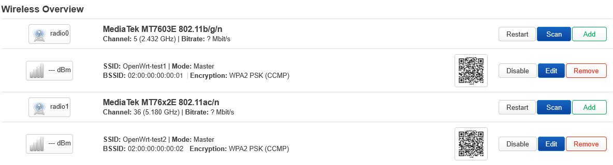
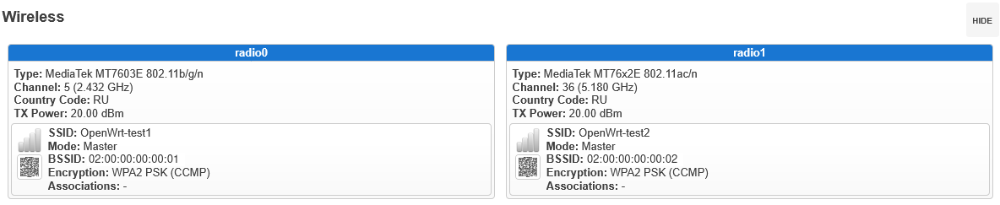
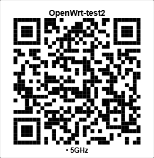

# OpenWrt Wi-Fi QR

Generate Wi-Fi QR codes locally on OpenWrt and display them directly in LuCI.

The project provides a command-line package for persistent SVG generation and
a LuCI package for authenticated, on-demand QR rendering.

> **Target platform:** OpenWrt 25.12.5 with the APK package manager.

## Packages

| Package | Contents | Dependencies |
| --- | --- | --- |
| `wi-fi-qr` | Shared shell module and the `wi-fi-qr` CLI | `qrencode`, `uci` |
| `luci-app-wi-fi-qr` | LuCI resources, authenticated RPCd backend, ACL, and renderer | `luci-base`, `wi-fi-qr` |

Both packages are architecture-independent (`noarch`). Their dependencies must
still be available for the target device.

The root [`VERSION`](VERSION) file is the project release version and maps to
Git tags as `v<version>`. OpenWrt package revisions remain separate in the two
package Makefiles, so version `1.0.0` with `PKG_RELEASE:=1` produces
`1.0.0-r1` packages.

## Highlights

- Reads enabled Wi-Fi interfaces directly from UCI.
- Handles WPA/WPA2-PSK, WPA3-SAE, mixed WPA2/WPA3, OWE, open networks,
  selected WEP key slots, and hidden SSIDs.
- Skips unsupported enterprise configurations and password-based networks
  without a usable key instead of producing misleading QR codes.
- Stages a complete SVG set before publication and preserves the previous set
  if generation or UCI access fails.
- Adds compact and medium QR previews to existing LuCI status pages.
- Keeps previews tied to the applied UCI configuration while LuCI changes are
  still pending.
- Suppresses LuCI's built-in QR control from the first rendered frame and
  keeps it hidden for disabled or unsupported networks. The built-in control
  returns only if the catalog or a matching custom render actually fails.
- Keeps SSIDs and passwords local; no external QR service is used.

## Compatibility

| Area | Target or verified environment |
| --- | --- |
| Target | OpenWrt 25.12.5 with APK |
| Build | Official OpenWrt 25.12.5 SDK for `ramips/mt7621` |
| Runtime hardware | Xiaomi Mi Router 3G |
| APK lifecycle | Fresh install, upgrade, removal, and reinstall |
| LuCI lifecycle | RPC registration, footer update, UI fallback, and cleanup |

The current release is made for OpenWrt 25.12.5. Other releases are outside
the documented compatibility target.

## Quick use

```text
wi-fi-qr --gen    Generate QR files for the current enabled networks
wi-fi-qr --list   List valid QR files already present on disk
wi-fi-qr --del    Delete generated QR files
```

The LuCI package augments **Status → Overview → Wireless** and
**Network → Wireless**. Selecting a preview opens a larger QR in a native LuCI
modal.

## LuCI screenshots

### Network → Wireless



### Status → Overview



### QR modal



Prebuilt release packages will be published after final validation. Until
then, build the APKs from the package sources in this repository.

## Documentation

- [Build, installation, verification, and removal](docs/INSTALLATION.md)
- [CLI and LuCI usage](docs/USAGE.md)
- [Security model](docs/SECURITY.md)

## Tests

Run the complete repository test suite from the project root:

```sh
for test_script in tests/test-*.sh; do
    sh "$test_script"
done
```

The suite covers Wi-Fi payload semantics, staged generation, CLI
streams and filename collisions, SVG escaping, APK maintainer hooks, package
layout, committed LuCI catalog behavior, native integration, RPC validation,
and built-in QR fallback.

## Maintainers

Maintained by [AmleyID](https://github.com/AmleyID) and developed and tested
in collaboration with [RazisID12](https://github.com/RazisID12).

## License

[MIT](LICENSE)
